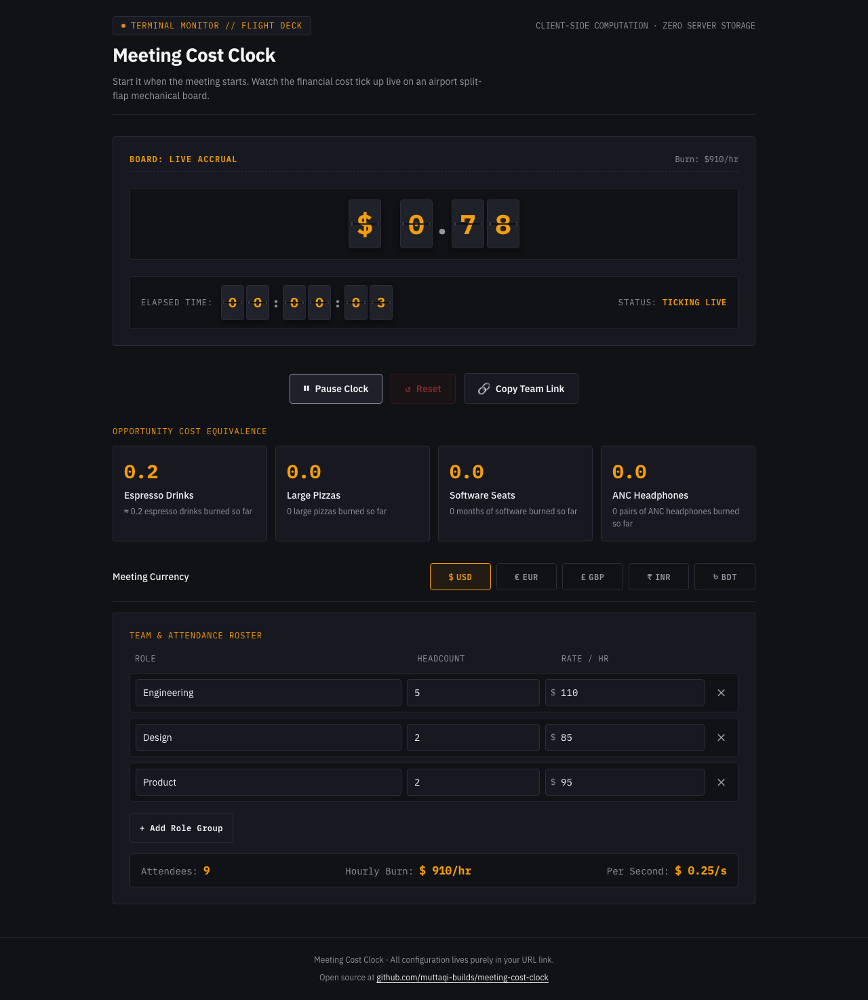

# Meeting Cost Clock

Start it when the meeting starts. Watch the cost tick up live on an airport split-flap mechanical board.

Live link: https://meeting-cost-clock-rouge.vercel.app



## Features

- **Split-Flap Mechanical Display**: Tabular numerals, warm off-black terminal housing, incandescent amber signal counter, and horizontal split seams.
- **Attendee Roles & Burn Rate**: Attendees grouped by discipline/role, each role with headcount and hourly rate, showing total attendees and burn rate per hour and per second.
- **Multi-Currency Support**: Switch between USD (`$`), EUR (`€`), GBP (`£`), INR (`₹`), and BDT (`৳`) with symbols and formatting.
- **Real-Time Precision**: Drift-free timing engine with start, pause, and reset controls.
- **Instant URL Sharing**: Entire roster and currency configuration lives directly in the URL query string (`?c=...&r=...`), allowing instant sharing with no accounts or database.
- **Tangible Opportunity Costs**: Live tickers that translate meeting burn into relatable quantities (espresso drinks, large pizzas, software seats, ANC headphones).

## How It Works & Privacy

All calculations and configuration run entirely inside your browser. No analytics, tracking pixels, or third-party cookies are used. Nothing leaves your browser: state is stored in your URL link, so you can bookmark or copy the exact meeting clock setup.

## Running Locally

Clone the repository and install dependencies with pnpm:

```bash
pnpm install
```

### Available Scripts

- `pnpm dev`: Start Vite development server
- `pnpm build`: Build production assets with TypeScript compilation
- `pnpm preview`: Preview production build on port 4317
- `pnpm lint`: Run ESLint checks
- `pnpm typecheck`: Run TypeScript typechecking
- `pnpm test`: Run Vitest unit tests
- `pnpm e2e`: Run Playwright end-to-end tests

## Environment Variables

None.

## Tech Stack

- React 19
- TypeScript
- Vite
- IBM Plex Mono & IBM Plex Sans (`@fontsource`)
- Vitest & Playwright
